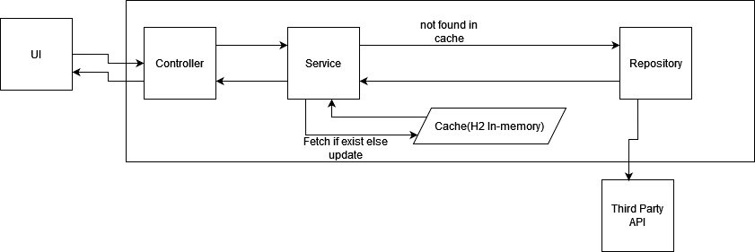

## This project is an example of spring boot microservice

# Application Design

# Build Image
./mvnw spring-boot:build-image

# Swagger
http://localhost:8080/swagger-ui.html
  
  
# UI Access
http://localhost:8080

# Docker tag
docker tag soccer-standings:1.0.0-SNAPSHOT thenextfreelancer/soccer-standings:1.0.0-SNAPSHOT

# Run
docker run --env API_URL=<url> --env API_KEY=<key> --network="host" -it thenextfreelancer/soccer-standings:1.0.0-SNAPSHOT

